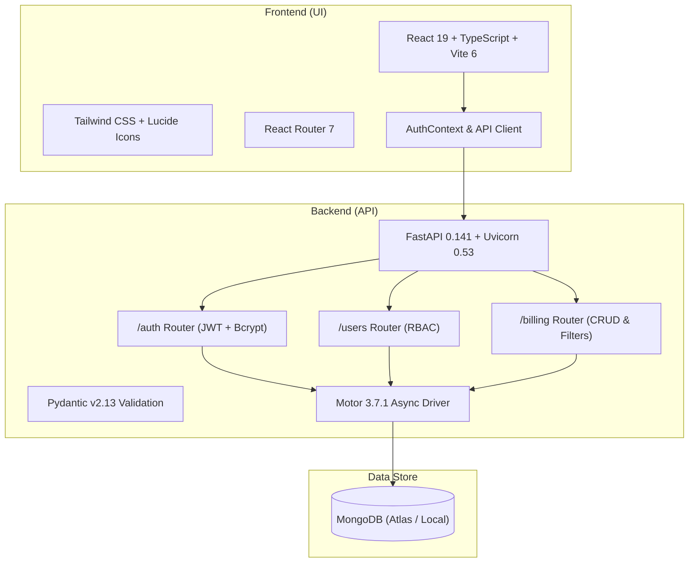

# 🛸 Shamuga Drone Operations & Billing Management System

A full-stack, enterprise-grade management and billing platform designed for agricultural drone spraying operations. The platform connects ground drone operators, administrators, and farmers—providing real-time spray record tracking, automated rate calculation, secure role-based access control, and financial reporting.

---

## 🏗️ Architecture Overview



---

## 📦 Tech Stack & Package Versions

Both the UI and API packages are updated to the latest compatible versions:

### 🎨 Frontend (UI)
| Package | Version | Description |
|---|---|---|
| **[React](https://react.dev/)** | `^19.3.0` | UI Library (React 19) |
| **[React DOM](https://react.dev/)** | `^19.3.0` | React DOM bindings |
| **[Vite](https://vitejs.dev/)** | `^6.4.3` | Next-generation frontend build tool |
| **[@vitejs/plugin-react](https://github.com/vitejs/vite-plugin-react)** | `^5.2.0` | Vite official React plugin |
| **[TypeScript](https://www.typescriptlang.org/)** | `^5.8.3` | Type system |
| **[React Router](https://reactrouter.com/)** | `^7.18.4` | Client-side routing and navigation |
| **[Lucide React](https://lucide.dev/)** | `^1.48.0` | Modern SVG iconography |
| **[Tailwind CSS](https://tailwindcss.com/)** | `^3.4.19` | Utility-first CSS framework |
| **[@supabase/supabase-js](https://supabase.com/)** | `^2.117.1` | Supabase JavaScript client |
| **[ESLint](https://eslint.org/)** | `^9.39.5` | Code linting and quality |
| **[PostCSS](https://postcss.org/)** & **[Autoprefixer](https://github.com/postcss/autoprefixer)** | `^8.5.28` / `^10.6.1` | CSS transformations |

### ⚙️ Backend (API)
| Package | Version | Description |
|---|---|---|
| **[FastAPI](https://fastapi.tiangolo.com/)** | `0.141.1` | High-performance async Python web framework |
| **[Uvicorn](https://www.uvicorn.org/)** | `0.53.0` | Lightning-fast ASGI server |
| **[Motor](https://motor.readthedocs.io/)** | `3.7.1` | Asynchronous Python driver for MongoDB |
| **[PyMongo](https://pymongo.readthedocs.io/)** | `4.18.1` | Python MongoDB driver |
| **[Pydantic](https://docs.pydantic.dev/)** | `2.13.5` | Data validation using Python type hints |
| **[Pydantic Settings](https://docs.pydantic.dev/latest/concepts/pydantic_settings/)** | `2.15.0` | Type-safe settings management via `.env` |
| **[Python-Jose](https://python-jose.readthedocs.io/)** | `3.5.0` | Cryptographic JWT signing and decoding |
| **[Bcrypt](https://github.com/pyca/bcrypt/)** | `5.0.0` | Secure password hashing algorithm |
| **[Passlib](https://passlib.readthedocs.io/)** | `1.7.4` | Password hashing framework |
| **[Python-Dotenv](https://github.com/theskumar/python-dotenv)** | `1.2.3` | Environment variable management |

---

## 🌟 Key Features

- **Role-Based Access Control (RBAC)**:
  - **Admin**: Complete system visibility, manage operator accounts, view system-wide revenue, filter and audit all bills, create/edit/delete billing records.
  - **Operator**: Streamlined interface for logging farm spray records, calculating costs by acreage/duration, viewing personal billing history.
- **Drone Spray Billing**:
  - Track acres covered, flight duration (hours), spray charges, and payment mode (`cash` or `upi`).
  - Bill inspection modal with formatted currency and timestamp tracking.
- **Search & Advanced Filters**:
  - Filter bills by operator, farmer name/ID, and custom date range.
  - Quick text search across bill amount, farmer, or record IDs.
- **Security & Authentication**:
  - JWT Bearer tokens with configurable expiration.
  - Strong password validation and bcrypt hashing.
  - Password reset and self-service profile update endpoints.
- **Database Management Tools**:
  - Automated seeding (`seed_data.py`) with sample drones, farmers, operators, and billing records.
  - Safe database purge script (`clean_database.py`) with confirmation safeguard.

---

## 📂 Project Structure

```
.
├── backend/
│   ├── app/
│   │   ├── core/
│   │   │   ├── config.py         # App settings (MONGO_URL, JWT secret, CORS)
│   │   │   ├── database.py       # Motor async client & connection lifecycle
│   │   │   └── security.py       # Password hashing & JWT generation/verification
│   │   ├── models/               # MongoDB entity data definitions
│   │   │   ├── billing.py
│   │   │   ├── drone.py
│   │   │   ├── farmer.py
│   │   │   ├── password_reset.py
│   │   │   └── user.py
│   │   ├── routers/              # Endpoint controllers
│   │   │   ├── auth.py           # /auth endpoints (register, login, password reset)
│   │   │   ├── billing.py        # /billing endpoints (CRUD, role-scoped queries)
│   │   │   └── users.py          # /users endpoints (profile & admin management)
│   │   ├── schemas/              # Pydantic validation schemas
│   │   │   ├── auth.py
│   │   │   ├── billing.py
│   │   │   ├── common.py
│   │   │   └── users.py
│   │   ├── services/             # Core business logic
│   │   ├── dependencies.py       # Dependency injection for user auth & RBAC
│   │   ├── enums.py              # User roles & enumerations
│   │   └── main.py               # FastAPI factory & lifespan
│   ├── docs/
│   │   └── MONGODB_SCHEMA.md     # MongoDB collection schema documentation
│   ├── scripts/
│   │   ├── clean_database.py     # Database cleanup script
│   │   ├── seed_data.py          # Sample data population script
│   │   └── README.md             # Scripts guide
│   ├── requirements.txt          # Python dependencies
│   └── .env                      # Backend environment variables
│
├── frontend/
│   ├── src/
│   │   ├── apis/                 # API client & backend integrations
│   │   │   ├── auth.ts           # Authentication API calls
│   │   │   ├── billing.ts        # Billing API calls
│   │   │   ├── client.ts         # Generic HTTP fetch wrapper
│   │   │   └── users.ts          # User & operator API calls
│   │   ├── components/           # Reusable UI components
│   │   │   ├── Bills/            # BillForm, BillTable, BillFilters, BillModals
│   │   │   ├── Layout/           # Navbar, ProtectedRoute
│   │   │   └── UI/               # Button, Card, Input
│   │   ├── contexts/             # React Contexts (AuthContext)
│   │   ├── pages/                # AdminDashboard, OperatorDashboard, Login, etc.
│   │   ├── theme/                # Custom color palette & design tokens
│   │   ├── App.tsx               # App routing configuration
│   │   └── main.tsx              # React DOM root
│   ├── package.json              # UI dependencies & scripts
│   ├── tailwind.config.js        # Tailwind CSS styling config
│   ├── tsconfig.json             # TypeScript configuration
│   └── vite.config.ts            # Vite configuration
│
└── README.md                     # Root project documentation
```

---

## 🚀 Getting Started

### Prerequisites

- **Node.js**: v18.0.0 or higher (v20+ recommended)
- **Python**: v3.10 or higher
- **MongoDB**: Local MongoDB instance (`localhost:27017`) or [MongoDB Atlas](https://www.mongodb.com/atlas) cluster

---

### Step 1: Configure & Start the Backend

1. **Navigate to the backend directory**:
   ```bash
   cd backend
   ```

2. **Create and activate a virtual environment**:
   ```bash
   python3 -m venv .venv
   source .venv/bin/activate    # On Windows: .venv\Scripts\activate
   ```

3. **Install updated Python dependencies**:
   ```bash
   pip install -r requirements.txt
   ```

4. **Verify `.env` configuration**:
   Ensure `backend/.env` exists with your database and JWT secret settings:
   ```env
   MONGO_URL=mongodb://localhost:27017/shamuga_drone
   DB_NAME=shamuga_drone_dev
   JWT_SECRET_KEY=super-secret-jwt-key-for-development-min-32-chars
   JWT_ALGORITHM=HS256
   JWT_EXPIRE_MINUTES=60
   ALLOWED_ORIGINS=http://localhost:3000,http://localhost:5173
   ```
   *(Note: Both `MONGO_URL` and `MONGO_URI` are supported).*

5. **Seed sample data** (initializes admin, operators, drones, and sample bills):
   ```bash
   python3 scripts/seed_data.py
   ```

6. **Start the FastAPI backend server**:
   ```bash
   uvicorn app.main:app --reload --host 0.0.0.0 --port 8000
   ```

   - API Server: `http://localhost:8000`
   - Interactive Swagger API Docs: `http://localhost:8000/docs`
   - ReDoc Documentation: `http://localhost:8000/redoc`

---

### Step 2: Configure & Start the Frontend

1. **Open a new terminal and navigate to the frontend directory**:
   ```bash
   cd frontend
   ```

2. **Install updated frontend packages**:
   ```bash
   npm install
   ```

3. **Verify or create frontend environment variables**:
   Create a `.env` in `frontend/` if connecting to external services (or default to local proxy):
   ```env
   VITE_API_URL=http://localhost:8000
   ```

4. **Run the development server**:
   ```bash
   npm run dev
   ```

5. **Open in browser**:
   Navigate to `http://localhost:5173`

---

## 🔑 Demo Credentials

After running `python3 scripts/seed_data.py`, use the following credentials to test role-based access:

| Role | Email | Password | Permissions |
|---|---|---|---|
| **Admin** | `admin@shamuga.com` | `admin123` | Full access: all bills, analytics, operator account creation |
| **Operator 1** | `drone1@shamuga.com` | `password123` | Field access: create bills, view own spray logs |
| **Operator 2** | `drone2@shamuga.com` | `password123` | Field access: create bills, view own spray logs |
| **Operator 3** | `drone3@shamuga.com` | `password123` | Field access: create bills, view own spray logs |

---

## 📡 API Endpoints Reference

### 🔐 Authentication (`/auth`)
| Method | Endpoint | Description | Access |
|---|---|---|---|
| `POST` | `/auth/register` | Register a new user/operator account | Public |
| `POST` | `/auth/login` | Login with email/password; returns JWT access token | Public |
| `POST` | `/auth/forgot-password` | Request password reset token | Public |
| `POST` | `/auth/reset-password` | Reset password using token | Public |
| `POST` | `/auth/change-password` | Change password for current logged-in user | Authenticated |

### 👥 Users Management (`/users`)
| Method | Endpoint | Description | Access |
|---|---|---|---|
| `GET` | `/users/me` | Fetch logged-in user profile | Authenticated |
| `PUT` | `/users/me` | Update personal user profile | Authenticated |
| `GET` | `/users/` | List all users (paginated) | Admin |
| `GET` | `/users/{user_id}` | Fetch user by ID | Admin / Self |
| `PUT` | `/users/{user_id}` | Update user details & status | Admin |
| `DELETE` | `/users/{user_id}` | Delete user account | Admin |

### 💵 Billing Management (`/billing`)
| Method | Endpoint | Description | Access |
|---|---|---|---|
| `POST` | `/billing/` | Create a new spray bill | Authenticated |
| `GET` | `/billing/` | List bills (Admins: all; Operators: own bills) | Authenticated |
| `GET` | `/billing/{id}` | Retrieve specific bill details | Authenticated |
| `PUT` | `/billing/{id}` | Update bill parameters | Admin / Creator |
| `DELETE` | `/billing/{id}` | Remove bill record | Admin |

---

## 🛠️ Common Commands

### Frontend Commands
```bash
# Start development server with HMR
npm run dev

# Run TypeScript typecheck without emitting files
npm run typecheck

# Build optimized production bundle
npm run build

# Run ESLint check
npm run lint

# Preview production build locally
npm run preview
```

### Backend Commands
```bash
# Run server with auto-reload
uvicorn app.main:app --reload

# Populate sample records (users, drones, farmers, bills)
python3 scripts/seed_data.py

# Wipe database collections (requires typed confirmation)
python3 scripts/clean_database.py
```

---

## 📄 License

This project is licensed under the MIT License.

